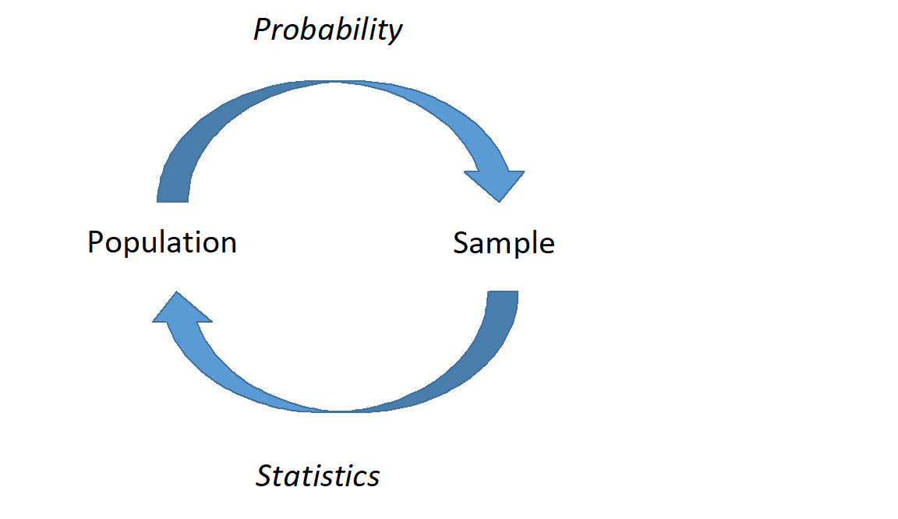

```{r setup, include=FALSE}
knitr::opts_chunk$set(echo = TRUE)
knitr::opts_chunk$set(fig.align='center')
knitr::opts_chunk$set(out.width = "75%")
library(knitr)
library(mosaic)
library(tidyverse)
library(cubature)
library(mosaicCalc)
library(fastR2)
```


\newcommand{\E}{\mbox{E}}
\newcommand{\Var}{\mbox{Var}}
\newcommand{\Cov}{\mbox{Cov}}
\newcommand{\Prob}{\mbox{P}}
\newcommand{\diff}{\,\mathrm{d}}


## Objectives

1) Obtain a method of moments estimate of a parameter or set of parameters.  

2) Given a random sample from a distribution, obtain the likelihood function. 

3) Obtain a maximum likelihood estimate of a parameter or set of parameters.  

## Transition

We started this course with descriptive models of data and then moved onto probability models. In these probability models, we have been characterizing experiments and ramdp, processes using both theory and simulation. These models are using a model about a random event to make decisions about data. These models are about the population and are used to make decisions about samples and data. For example, suppose we flip a fair coin 10 times, and record the number of heads. The population is the collection of all possible outcomes of this experiment. In this case, the population is infinite, as we could run this experiment repeatedly without limit. If we assume, model, the number of heads as a binomial distribution, we know the exact distribution of the outcomes. For example, we know that exactly 24.61% of the time, we will obtain 5 heads out of 10 flips of a fair coin. We can also use the model to characterize the variance, that is when it does not equal 5 and how much different from 5 it will be.  However, these probability models are highly dependent on the assumptions and the values of the parameters. 

From this point on in the course, we will focus on *statistical* models.  Statistical models describe one or more variables and their relationships. We use these models to make decisions about the population, to predict  future outcomes, or both. Often we don't know the true underlying process; all we have is a *sample* of observations and perhaps some context. Using *inferential* statistics, we can draw conclusions about the underlying process. For example, suppose we are given a coin and we don't know whether it is fair. So, we flip it a number of times to obtain a sample of outcomes. We can use that sample to decide whether the coin could be fair. 

In some sense, we've already explored some of these concepts. In our simulation examples, we have drawn observations from a population of interest and used those observations to estimate characteristics of another population or segment of the experiment. For example, we explored random variable $Z$, where $Z=X^2 + Y$ and $X$ and $Y$ were both uniform random variables. Instead of dealing with the distribution of $Z$ directly, we simulated many observations from $Z$ and used this simulation to describe the behavior of $Z$. 

Statistical models and probability models are not separate. In statistical models we find relationships, the explained portion of variation, and use probability models for the remaining random variation. In Figure 1, we demonstrate this relationship between the two models. In the first part of our studies, we will use univariate data in statistical models to estimate the parameters of a probability model. From there we will develop more sophisticated models to include multivariate models.

```{r lesson18pic,echo=F,fig.align='center',fig.height=2,fig.width=3,fig.cap="A graphical representation of probability and statistics. In probability, we describe what we expect to happen if we know that underlying process; in statistics, we don't know the underlying process, and must infer based on representative samples."}

```


## Estimation  
Recall that in probability models, we have complete information about the population and we use that to describe the expected behavior of samples from that population. In statistics we are given a sample from a population about which we know little or nothing. 

In this lesson, we will discuss *estimation*. Given a sample, we would like to estimate population parameters. There are several ways to do that. We will discuss two methods: *method of moments* and *maximum likelihood*. 

## Method of Moments

Recall earlier we discussed moments. We can refer to $\E(X) = \mu$ as the first moment or mean. Further, we can refer to $\E(X^k)$ as the $k$th central moment and $\E[(X-\mu)^k]$ as the $k$ moment around the mean. The second moment around the mean is also known as variance. It is important to point out that these are **POPULATION** moments and are typically some function of the parameters of a probability model. 

Suppose $X_1,X_2,...,X_n$ is a sequence of independent, identically distributed random variables with some distribution and parameters $\boldsymbol{\theta}$. When provided with a random sample of data, we will not know the population moments. However, we can obtain *sample moments*. The $k$th central sample moment is denoted by $\hat{\mu}_k$ and is given by
$$
\hat{\mu}_k = \frac{1}{n}\sum_{i=1}^n x_i^k
$$

The $k$th sample moment around the mean is denoted by $\hat{\mu}'_k$ and is given by
$$
\hat{\mu}'_k=\frac{1}{n} \sum_{i=1}^n (x_i-\bar{x})^k
$$

The value $\hat{\mu}$ is read "mu-hat". The hat denotes that the value is an estimate. 

We can use the sample moments to estimate the population moments since the population moments are usually functions of a distribution's parameters, $\boldsymbol{\theta}$. Thus, we can solve for the parameters to obtain method of moments estimates of $\boldsymbol{\theta}$. 

This is all technical, so let's look at an example. 

> *Example*:  
(Modified from Pruim 2011). Suppose $x_1,x_2,...,x_n$ is an iid sample from a uniform distribution $\textsf{Unif}(0,\theta)$, and we don't know $\theta$. That is, are data consists of positive random numbers but we don't know the upper bound. Find the method of moments estimator for $\theta$, the upper bound. 

We know that if $X\sim \textsf{Unif}(a,b)$, then $\E(X)=\frac{a+b}{2}$. So, in this case, $\E(X)={\theta \over 2}$. This is the first population moment. We can estimate this with the first *sample* moment, which is just the sample mean:
$$
\hat{\mu}_1=\frac{1}{n}\sum_{i=1}^n x_i = \bar{x}
$$

Our best guess for the first population moment ($\theta/2$) is the first sample moment ($\bar{x}$). From a common sense perspective, we are hoping that the sample moment will be close in value to the population moment, so we can set them equal and solve for the unknown population parameter. This is essentially what we were doing in our simulations of probability models. Solving for $\theta$ yields our method of moments estimator for $\theta$:
$$
\hat{\theta}_{MoM}=2\bar{x}
$$

Note that we could have used the second moments about the mean as well. This is less intuitive but still applicable. In this case we know that if $X\sim \textsf{Unif}(a,b)$, then $\Var(X)=\frac{(b -   a)^2}{12}$. So, in this case, $\Var(X)=\frac{\theta ^2}{ 12}$. We use the second sample moment about the mean $\hat{\mu}'_2=\frac{1}{n} \sum_{i=1}^n (x_i-\bar{x})^2$ which is not quite the sample variance. In fact, the sample variance is related to the second sample moment about the mean by $\hat{\mu}'_2 = s^2 \frac{n}{n-1}$. Setting the population moment and sample moment equal and solving we get 

$$
\hat{\theta}_{MoM}=\sqrt{\frac{12n}{n-1}}s
$$

To decide which is better we need a criteria of comparison. This is beyond the scope of this class, but so common criteria are *unbiased* and *minimum variance*.

The method of moments can be used to estimate more than one parameter as well. We simply would have to incorporate higher order moments. 

> *Example*:  
Suppose we take an iid sample from the normal distribution with parameters $\mu$ and $\sigma$. Find method of moments estimates of $\mu$ and $\sigma$. 

First, we remember that we know two population moments for the normal distribution:
$$
\E(X)=\mu \hspace{1cm} \Var(X)=\E[(X-\mu)^2]=\sigma^2
$$

Setting these equal to the sample moments yields:
$$
\hat{\mu}_{MoM}=\bar{x} \hspace{1cm} \hat{\sigma}_{MoM} = \sqrt{\frac{1}{n}\sum_{i=1}^n (x_i-\bar{x})^2}
$$

Again, we notice that the estimate for $\sigma$ is different from sample standard deviation discussed earlier in the semester. The reason for this is a property of estimators called *unbiased*. Notice that if we treat the data points as random variables then the estimators are random variables. We can then take the expected value of the estimator and if this equals the parameter being estimated, then it is unbiased. Mathematically, this is written
$$
E(\hat{\theta})=\theta
$$
It is not required for an estimated but many practioners find it desireable. In words, unbiased means that on average the estimator will equal the true value. Sample variance using $n-1$ in the denominator is an unbiased estimte of the population variance.

> *Exercise*:  
You shot 25 free throws and make 21. Assuming a binomial model fits. Find an estimate of the probability of making a free throw.

There are two ways to approach this problem depending on how we define the random variable. In the first case we will use a binomial. Recall for the binomial $E(X)=np$ where $X$ is the number of heads in 25 free throws. From the data we get the sample number of heads as $21$. Thus $np=\sum{x_i}$ of $25 \hat{p} = 21$ and thus $\hat{p} = \frac{21}{25}$.  

If we let $X_i$ be a single trial, a Bernoulli random variable, then $E(X)=p$ and we set this equal to the sample mean $\bar{x}$ and thus obtain $\hat{p} = \frac{21}{25}$. This is an unbiased estimator since
$$
E(\hat{p})=E\left( \sum{\frac{X_i}{n}} \right)
$$

$$
=  \sum{E\left( \frac{X_i}{n} \right)}= \sum{ \frac{E\left(X_i\right)}{n}}=\sum{\frac{p}{n}}=\frac{np}{n}=p
$$

## Maximum likelihood

Recall that using method of moments involves finding values of the parameters that cause the population moments to be equal to the sample moments. Solving for the parameters yields method of moments estimates. 

Next we will discuss one more estimation method, *maximum likelihood estimation*. In this method, we are finding values of parameters that would make the observed data most "likely". In order to do this, we first need to introduce the *likelihood function*. 

### Likelihood Function

Suppose $x_1,x_2,...,x_n$ is an iid random sample from a distribution with mass/density function $f_{X}(x;\boldsymbol{\theta})$ where $\boldsymbol{\theta}$ is unknown. The likelihood function is denoted as $L(\boldsymbol{\theta};x_1,x_2,...,x_n) = L(\boldsymbol{\theta};\boldsymbol{x})$ and is essentially the probability of our sample occurring given $\boldsymbol{\theta}$, or $f_X(\boldsymbol{x};\boldsymbol{\theta})$. Since our random sample is iid, we can rewrite this:
$$
L(\boldsymbol{\theta};\boldsymbol{x})=\prod_{i=1}^n f_X(x_i;\boldsymbol{\theta})
$$

The likelihood function is really the pmf/pdf except instead of the variables being random and the parameter(s) fixed, the values of the variable are known and the parameter(s) are unknown.

> *Example*:  
Suppose we are presented with a coin and are unsure of its fairness. We toss the coin 50 times and obtain 18 heads and 32 tails. Let $\pi$, we could use $p$ but we are getting you used to the two different common ways to represent a binomial parameter, be the probability that a coin flip results in heads. What is the likelihood function of $\pi$? 

This is a binomial process, but each individual coin flip can be thought of as a Bernoulli experiment. That is, $x_1,x_2,...,x_{50}$ is an iid sample from $\textsf{Binom}(1,\pi)$ or, in other words, $\textsf{Bernoulli}(\pi)$. Each $x_i$ is either 1 or 0. The pmf of any individual $X$ is simply
$$
f_X(x;\pi)= \binom{1}{x} \pi^x(1-\pi)^{1-x} = \pi^x(1-\pi)^{1-x}
$$

Generalizing for any sample size $n$, the likelihood function is:
$$
L(\pi;\boldsymbol{x})=\prod_{i=1}^{n} \pi^{x_i}(1-\pi)^{1-x_i} = \pi^{\sum_{i=1}^{n} x_i}(1-\pi)^{n-\sum_{i=1}^{n} x_i}
$$


### Maximum Likelihood Estimation

Once we have a likelihood function $L(\boldsymbol{\theta},\boldsymbol{x})$, we need to figure out which value of $\boldsymbol{\theta}$ makes the data most likely. In other words, we need to maximize $L$ with respect to $\boldsymbol{\theta}$. 

Most of the time (but not always), this will involve simple optimization through calculus (i.e., take the derivative with respect to the parameter, set to 0 and solve for the parameter). When maximizing the likelihood function through calculus, it is often easier to maximize the log of the likelihood function, denoted as $l$ and often referred to as the "log-likelihood function":
$$
l(\boldsymbol{\theta};\boldsymbol{x})= \log L(\boldsymbol{\theta};\boldsymbol{x}) 
$$
Note that since logarithm is one-to-one, onto and increasing, maximizing the log-likelihood function is equivalent to maximizing the likelihood function, and the maximum will occur at the same values of the parameters. We are using `log` because now we can take the derivative of a sum instead of a product, thus making it much easier.

> *Example*:  
Continuing our example. Find the maximum likelihood estimator for $\pi$. 

Recall that our likelihood function is 
$$
L(\pi;\boldsymbol{x})= \pi^{\sum x_i}(1-\pi)^{n-\sum x_i}
$$

```{r lesson21a,fig.cap="Likelihood function for 18 successes in 50 trials"}
#18 heads, 32 tails, order doesn't matter
x<-c(rep(1,18),rep(0,32))
n<-50
pis<-seq(0.01,0.99,0.01)
lhood<-sapply(pis,function(y) prod(dbinom(x,1,y)))
plot(pis,lhood,type="l",xlab="pi",ylab="Likelihood")
```
To maximize, we need to take the derivative of this with respect to $\pi$. We can do this by applying the product rule:
$$
{\diff L(\pi;\boldsymbol{x})\over \diff \pi} = \left(\sum x_i\right) \pi^{\sum x_i -1}(1-\pi)^{n-\sum x_i} + \pi^{\sum x_i}\left(\sum x_i -n\right)(1-\pi)^{n-\sum x_i -1}
$$

We could simplify this, set to 0, and solve for $\pi$. However, it may be easier to use the log-likelihood function:
$$
l(\pi;\boldsymbol{x})=\log L(\pi;\boldsymbol{x})= \log \left(\pi^{\sum x_i}(1-\pi)^{n-\sum x_i}\right) = \sum x_i \log \pi + (n-\sum x_i)\log (1-\pi)
$$

Now, taking the derivative:
$$
{\diff l(\pi;\boldsymbol{x})\over \diff \pi}= {\sum x_i \over \pi} - {n-\sum x_i\over (1-\pi)}
$$

Setting equal to 0 yields:
$$
{\sum x_i \over \pi} ={n-\sum x_i\over (1-\pi)}
$$

Solving for $\pi$ yields
$$
\hat{\pi}_{MLE}={\sum x_i \over n}
$$

Note that technically, we should confirm that the function is concave down at our critical value, ensuring that $\hat{\pi}_{MLE}$ is, in fact, a maximum: 
$$
{\diff^2 l(\pi;\boldsymbol{x})\over \diff \pi^2}= {-\sum x_i \over \pi^2} - {n-\sum x_i\over (1-\pi)^2}
$$

This value is negative for all relevant values of $\pi$, so $l$ is concave down and $\hat{\pi}_{MLE}$ is a maximum. 

In the case of our example (18 heads out of 50 trials), $\hat{\pi}_{MLE}=18/50=0.36$. 

This seems to make sense. Our best guess for the probability of heads is the number of observed heads divided by our number of trials. 


### Numerical Methods

When obtaining MLEs, there are times when analytical methods (calculus) are not feasible or not possible. In Pruim 2011, there is a good example regarding data from Old Faithful at Yellowstone National Park. We need the `fastR2` package for this example. 

```{r eval=FALSE}
library(fastR2)
```


The `faithful` dataset is preloaded into `R` and contains 272 observations of 2 variables: eruption time in minutes and waiting time until next eruption. If we plot eruption durations, we notice that the distribution appears bimodal:
```{r lesson21b}
histogram(~eruptions,data=faithful,breaks=30)
```

Within each section, the distribution appears somewhat bell-curve-ish so we'll model this with a mixture of two normal distributions. In this mixture, a proportion $\alpha$ of our eruptions belong to one normal distribution and the remaining $1-\alpha$ belong to the other normal distribution. The density function of eruptions is given by:
$$
\alpha f(x;\mu_1,\sigma_1)+(1-\alpha)f(x;\mu_2,\sigma_2)
$$

where $f$ is the pdf of the normal distribution with parameters specified. 

We have five parameters to estimate: $\alpha, \mu_1, \mu_2, \sigma_1, \sigma_2$. Obviously, estimation through differentiation is not feasible. Thus, we will use numerical methods. This code is less in the spirit of `tidyverse` but we want you to see the example. Try to work your way through the code below:
```{r lesson21c}
# Define function for pdf of eruptions
dmix<-function(x,alpha,mu1,mu2,sigma1,sigma2){
  if(alpha < 0) dnorm(x,mu2,sigma2)
  if(alpha > 1) dnorm(x,mu1,sigma1)
  if(alpha >= 0 && alpha <=1){
    alpha*dnorm(x,mu1,sigma1)+(1-alpha)*dnorm(x,mu2,sigma2)
  }
}

# Create the log-likelihood function
loglik<-function(theta,x){
  alpha=theta[1]
  mu1=theta[2]
  mu2=theta[3]
  sigma1=theta[4]
  sigma2=theta[5]
  density<-function(x){
    if(alpha<0) return (Inf)
    if(alpha>1) return (Inf)
    if(sigma1<0) return (Inf)
    if(sigma2<0) return (Inf)
    dmix(x,alpha,mu1,mu2,sigma1,sigma2)
  }
  sum(log(sapply(x,density)))
}

m<-mean(faithful$eruptions)
s<-sd(faithful$eruptions)

oldopt<-options(warn=-1)
mle<-nlmax(loglik,p=c(0.5,m-1,m+1,s,s),x=faithful$eruptions)$estimate
mle
options(oldopt)
```

So, according to our MLEs, about 34.84% of the eruptions belong to the first normal distribution (the one on the left). Furthermore the parameters of that first distribution are 2.019 and 0.236. And so on. Plotting the density atop the histogram shows a fairly good fit: 
```{r lesson21d}
dmix2<-function(x) dmix(x,mle[1],mle[2],mle[3],mle[4],mle[5])
hist(faithful$eruptions,breaks=40,freq=F,main="",xlab="eruptions")
curve(dmix2,from=1,to=6,add=T)
```

This is a fairly elaborate example but it is cool. You can see the power of the method and the software. 

### File Creation Information 

  * File creation date: `r Sys.Date()`
  * Windows version: `r win.version()`
  * `r R.version.string`
  * `mosaic` package version: `r packageVersion("mosaic")`
  * `tidyverse` package version: `r packageVersion("tidyverse")`
   * `fastR2` package version: `r packageVersion("fastR2")`